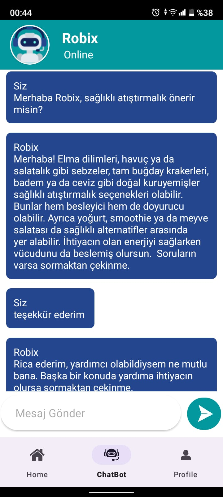

# My Health Assistant
## Mobile App 
### Android Studio-Java 

My Health Assistant, fiziksel ve zihinsel sağlığınızı desteklemek için geliştirilmiş, yapay zekâ entegreli bir mobil uygulamadır.

## Özellikler

- Sağlık AI asistanı
- Beslenme programları
- Spor programları
- Eğitim içerikleri
- Motivasyon bölümü

## Ekran Görüntüleri

### Başlangıç Ekranı

### Ana Ekran

### Sağlık AI asistanı

### Beslenme Programı

### Spor Programı

### Motivasyon Bölümü

### Ayarlar Bölümü

